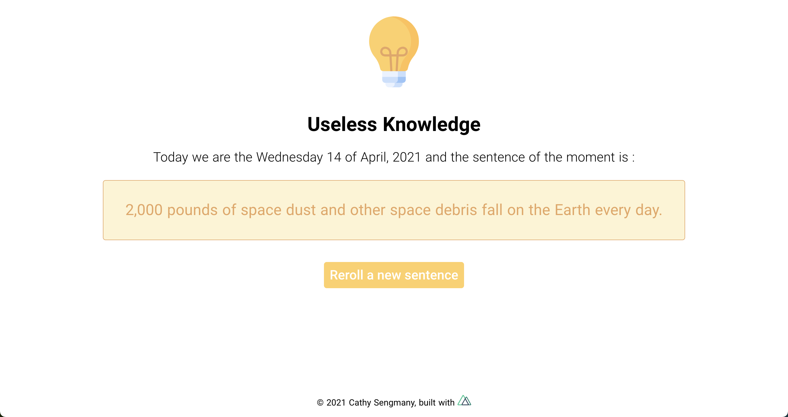

# Useless Knowledge

## Overview

VueJS training project.
Generate a new fact.
Click on the text to copy.
<br>

- Link to website : [https://usless-knowledge-cathy.netlify.app/](https://usless-knowledge-cathy.netlify.app/)

## Screenshots

<div align="center">
    
</div>

## Build Setup

```bash
# install dependencies
$ npm install

# serve with hot reload at localhost:3000
$ npm run dev

# build for production and launch server
$ npm run build
$ npm run start

# generate static project
$ npm run generate
```

For detailed explanation on how things work, check out [Nuxt.js docs](https://nuxtjs.org).
